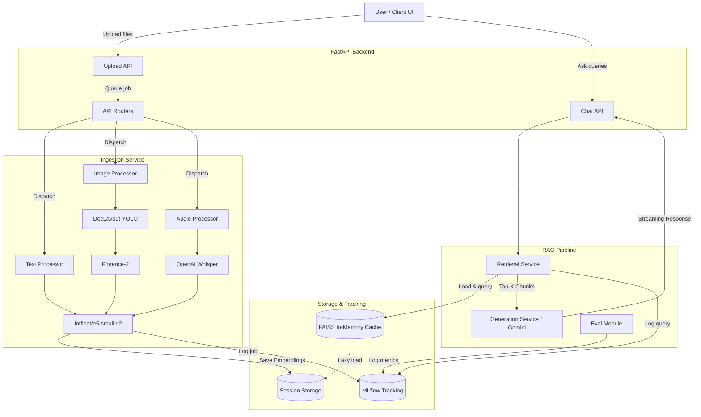

# Architecture Deep-Dive

This document provides a detailed look into the architecture of the Multimodal RAG Platform, describing how data flows through ingestion, retrieval, and generation phases. The entire pipeline is implemented using **PyTorch** for local model inference.

## Full System Architecture

## 1. Ingestion Data Flow

The ingestion pipeline transforms raw unstructured files into structured embeddings.

1. **Upload & Dispatch:** A file is uploaded to the backend. The API creates a background job and dispatches it to the corresponding processor (Text, Image, Audio).
2. **Text Processing:** Text files (PDF, DOCX, TXT) are parsed. PDFs use PyMuPDF for reliable text extraction. Text is chunked (e.g., 1000 characters, 100 overlap).
3. **Image & Visual PDF Processing (Two-Phase):**
   - **Phase 1 (DocLayout-YOLO):** Identifies figures and tables in PDFs, associates them with their captions using spatial geometry, and crops them.
   - **Phase 2 (Florence-2):** Generates highly detailed captions and performs OCR on the extracted images (or standalone uploaded images).
4. **Audio Processing:** Audio files are transcribed using OpenAI Whisper. Timestamps are extracted to provide temporal grounding.
5. **Embedding:** The processed text, image captions, OCR text, and audio transcripts are fed into the embedding model (`intfloat/e5-small-v2`).
6. **Storage:** The resulting embeddings are saved as `.pkl` files in the session's workspace.

## 2. Retrieval + Generation Data Flow

When a user asks a question, the platform executes a RAG retrieval and generation loop:

1. **Query Embedding:** The user's text query is embedded using the same `e5-small-v2` model (prepended with the instruction `query: `).
2. **Index Building (Cache):** If the FAISS index for the current session is not in memory, the `retrieval_service` loads all `.pkl` embeddings for that session, merges them, and builds an L2 FAISS index.
3. **Retrieval:** FAISS performs an exact nearest-neighbor search to retrieve the top-K chunks.
4. **Prompt Construction:** The retrieved multimodal chunks are serialized into a heavily formatted prompt string, decorated with source file names, modality labels, and timestamps.
5. **Generation:** The prompt is sent to the LLM (`gemini-2.5-flash`). The response is streamed back to the client word-by-word (via Server-Sent Events) to minimize perceived latency.
6. **Telemetry:** The query, retrieved chunks, and estimated relevance metrics are logged to MLflow asynchronously.

## 3. Scalability Notes

The current implementation is optimized for **local deployment, rapid prototyping, and edge execution**. It uses file-backed `.pkl` storage and an in-memory `faiss.IndexFlatL2` per session.

**To transition to production scale (thousands of users, millions of documents):**

- **Swap FAISS for a Vector Database:** Replace the local FAISS in-memory cache with a managed vector database like **Pinecone, Weaviate, Qdrant, or Milvus**. This removes the need to rebuild indexes on-the-fly and supports distributed CRUD operations.
- **Asynchronous Message Queue:** Replace the simple Python background threading for ingestion with a robust task queue like **Celery** or **RabbitMQ**.
- **Blob Storage:** Move raw files and images out of the local filesystem and into AWS S3 or Google Cloud Storage.
- **Model Endpoints:** Instead of loading Florence-2 and YOLO locally, host them on dedicated inference endpoints (e.g., vLLM or Triton) to auto-scale horizontally independently of the web API.

## 4. Model Comparison: Why E5 over others?

We selected `intfloat/e5-small-v2` (and its larger variants like `e5-base-v2`) for the core embedding representation over other popular alternatives like `all-MiniLM-L6-v2`, `bge-base-en`, or OpenAI's `text-embedding-3`.

| Model | Dimensions | Speed | Multilingual | Why it was or wasn't chosen |
|---|---|---|---|---|
| **intfloat/e5-small-v2** | 384 | **Very Fast** | En | **Selected.** State-of-the-art for its size. Uses a simple "query:" vs "passage:" prompting prefix which perfectly aligns with our asymmetric RAG retrieval task (short questions retrieving long passages). |
| **BAAI/bge-base-en-v1.5** | 768 | Moderately Fast | En | Excellent performance, but larger and slower on CPU-only deployments. We fall back to small E5 to guarantee edge usability. |
| **all-MiniLM-L6-v2** | 384 | Fastest | En | Excellent speed, but optimized for symmetric semantic similarity rather than asymmetric QA retrieval. E5 consistently outperforms it on BEIR benchmarks. |
| **OpenAI text-embedding-3** | 1536 | API Bound | Yes | Requires API calls and incurs ongoing costs. Defeats the purpose of our local, privacy-preserving ingestion pipeline. |
| **CLIP (ViT-B/32)** | 512 | Fast (GPU) | No | True multimodal embedding. We opted *against* CLIP because it struggles with dense text and OCR. Processing images into detailed text via Florence-2 and embedding as text provides far superior results for reading comprehension and document QA. |
