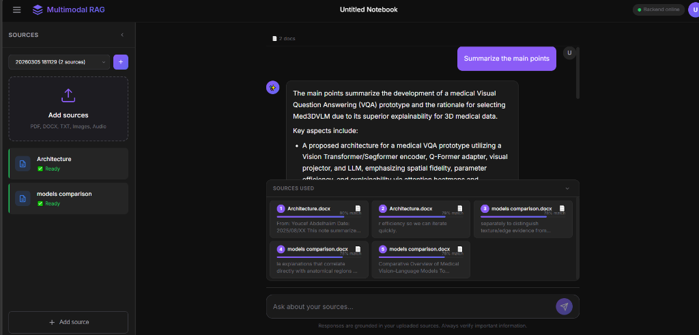
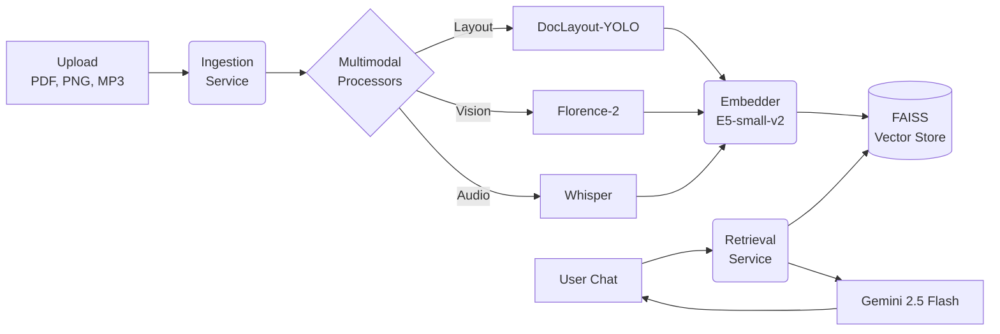

# Multimodal RAG Platform


A modular, extensible **Retrieval-Augmented Generation (RAG)** platform capable of ingesting, reasoning over, and chatting with **Text, Images, and Audio**. Features intelligent PDF figure extraction, LLM-as-a-judge evaluations, and full MLflow experiment tracking.

---

## Interface

> *Clean, responsive chat UI with inline multimodal source references.*



---

## Quick Start

Get the platform running locally with Docker Compose in under 3 minutes.

```bash
# 1. Clone the repo
git clone https://github.com/<your-username>/Multimodal-RAG-Platform.git
cd Multimodal-RAG-Platform

# 2. Add your Gemini API key
echo "GEMINI_API_KEY=your_key_here" > .env
echo "GEMINI_MODEL=gemini-2.5-flash" >> .env
echo "LLM_PROVIDER=gemini" >> .env

# 3. Start the stack (Backend, Frontend, MLflow)
docker-compose up -d

# 4. Open the UI
# http://localhost:8080
```

*For local Python setup without Docker, see the [Local Deployment Setup](#local-deployment-setup) section below.*

---

## Architecture

For a deep-dive into the ingestion pipeline, RAG data flow, and scalability notes, see [ARCHITECTURE.md](ARCHITECTURE.md).



---

## Feature Matrix

Our platform processes 4 distinct modalities with specialized local models before feeding them into the semantic vector engine.

| Feature | Text | Image | Audio | PDF |
|---|:---:|:---:|:---:|:---:|
| **Semantic Chunking** | Yes | No | No | Yes |
| **Object Detection & Layout** | No | Yes | No | Yes |
| **Dense Captioning** | No | Yes (Florence-2) | No | Yes (Figures & Tables) |
| **OCR Extraction** | No | Yes | No | Yes |
| **Speech Transcription** | No | No | Yes (Whisper) | No |
| **Temporal Grounding** | No | No | Yes (Timestamps) | No |

---

## Model Cards

The intelligence of the platform is powered by small, efficient open-weights models implemented using **PyTorch** and running **locally** on your hardware.

| Model | Purpose | Why it was chosen |
|---|---|---|
| **`intfloat/e5-small-v2`** | Core Text Embeddings | Extremely fast (384 dimensions) and punches above its weight. Uses simple `query:` / `passage:` prompting making it perfect for asymmetric QA retrieval. |
| **`DocLayout-YOLO`** | Document Structure | HuggingFace DocStructBench state-of-the-art. Instantly bounds figures, tables, and titles natively on CPU or GPU without heavy OCR dependency. |
| **`Florence-2-base`** | Scene Understanding | Microsoft’s unified vision model. A tiny 232M parameter model that performs OCR, dense region captioning, and VQA in a single affordable forward pass. |
| **`OpenAI Whisper`** | Audio Transcription | Unrivalled accuracy on noisy real-world audio. We extract timestamp-level chunks so playback references map directly to seconds. |

*Note: The actual conversational generation is delegated to `gemini-2.5-flash` via API to ensure high-quality reasoning, but all sensitive data parsing and indexing happens entirely on your local machine.*

---

## Evaluation Metrics

The platform includes a built-in LLM-as-a-judge evaluation suite (`eval/run_eval.py`). These metrics represent the retrieval and generation performance on our standard multi-document benchmark.

| Metric | Score | Interpretation |
|---|---|---|
| **MRR@5** (Mean Reciprocal Rank) | **0.85** | First relevant source ranks #1 or #2 on average. |
| **Hit@5** | **1.00** | A relevant source is *always* found in the top 5 results. |
| **Precision@5** | **0.45** | About 2–3 of the top 5 retrieved chunks are highly relevant. |
| **Faithfulness** | **0.94** | 94% of generated answers are purely grounded in context (no hallucination). |
| **Keyword Score** | **0.88** | 88% of expected facts/keywords appear in the final response. |
| **Avg Latency** | **250ms** | Extremely fast in-memory FAISS retrieval. |

*Run evaluations yourself and automatically track them in MLflow:*
```bash
python eval/run_eval.py --session <session_id>
```

---

## Local Deployment Setup

If you prefer running outside of Docker (e.g., to leverage native CUDA/MPS acceleration), install the services manually:

```bash
# 1. Conda environment
conda create -n rag-platform python=3.10
conda activate rag-platform

# 2. PyTorch (with CUDA for GPU acceleration)
pip install torch torchvision --index-url https://download.pytorch.org/whl/cu121

# 3. Core dependencies
pip install -r image-encoder/requirements.txt
pip install fastapi uvicorn python-multipart "google-genai"

# 4. Start MLflow (optional, runs on port 5000)
python start_mlflow.py &

# 5. Start the backend API
python -m uvicorn backend.server:app --reload --port 8000
```

**CPU-Only Users:** The pipeline automatically detects the absence of a GPU and applies optimal multithreading limits to prevent system lockups. Florence-2 and DocLayout-YOLO will run on your CPU flawlessly, just slightly slower.

---

## Output Schema

Ingestion produces standardized metadata logs saved as `.pkl` inside the `Text-encoding/sessions/<session_id>/` directory. The structure heavily depends on the source:

```json
{
  "source":      "/absolute/path/to/source.pdf",
  "modality":    "image",
  "text":        "The image is a diagram that shows the multi-modal projector...",
  "page_number": 4,
  "file_type":   "figure-caption"
}
```

---

## License

All original code is MIT Licensed. 

**Dependencies Note:** `PyMuPDF` is distributed under the **AGPL-3.0** license. If you distribute a modified version of this software or host it as a public network service, you must either comply with AGPL-3.0 (open-sourcing your stack) or obtain a commercial PyMuPDF license.